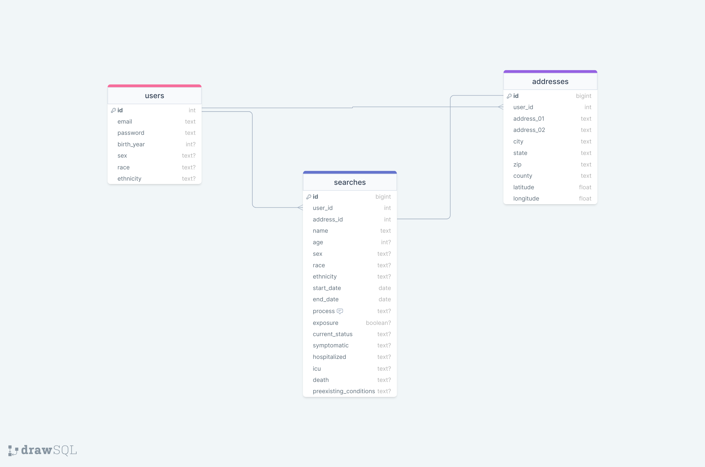

# Will it kill me, though?

## API
### COVID-19 Case Surveillance Public Use Data with Geography
https://dev.socrata.com/foundry/data.cdc.gov/n8mc-b4w4

### Google Maps JavaScript API
https://developers.google.com/maps/documentation/javascript 

## Database Schema 

- users/birth_year will be used to calculate the users age group. 
- searches/address_id will link to an address, but the only thing it really cares about is the county since that is what the API is providing. I might have to use a different API to extract county info from the address.
- addresses/latitude and addresses/longitude will be provided by the google maps API. 

